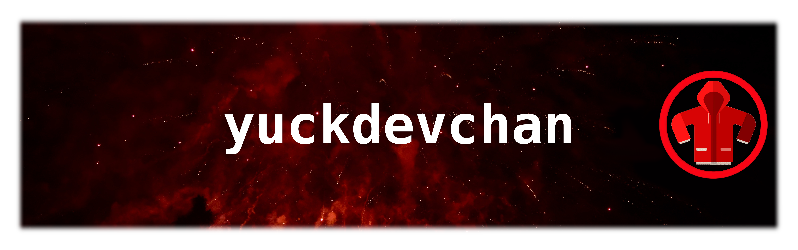

- 🔭 I’m currently working on [my Music Server Supersonic](https://github.com/yuckdevchan/supersonic-server) and a [client for it, Supersonic Desktop](https://github.com/yuckdevchan/supersonic-desktop).
- 🌱 I’m currently learning Astro and Tailwind
- 📫 How to reach me: create an issue on one of my repos
